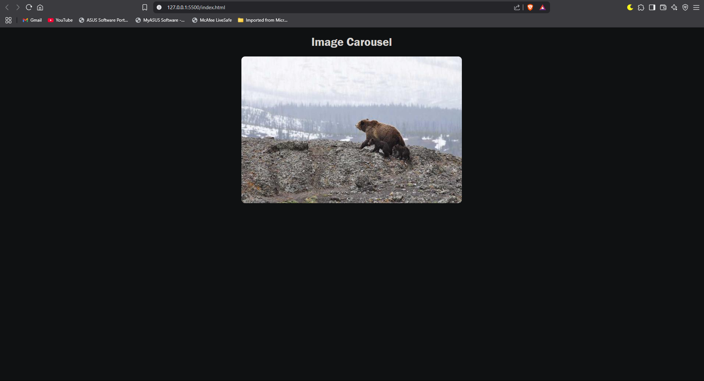

# 🌄 Image Slider / Carousel

A sleek, responsive image slider built with **HTML, CSS, and JavaScript**.  
This project helps front-end developers practice DOM manipulation, styling, and animation.

---

## 🚀 Features

- 🔁 **Auto-slideshow**: Images auto-transition every 3 seconds.
- 🖱️ **Manual controls**: Navigate with Previous/Next buttons.
- 🎯 **Looping**: Slides loop infinitely for a seamless experience.
- 🎨 **Responsive design**: Works on mobile, tablet, and desktop.
- 🧼 **Clean UI**: Navigation buttons only appear on hover.

---

## 📸 Demo

---

## 🧰 Technologies Used

- HTML5
- CSS3 (Flexbox, transitions)
- Vanilla JavaScripteeed

---

## 🛠️ How It Works

- Images are stored in a JavaScript array.
- On load, the images are dynamically injected into the DOM.
- Navigation functions (`nextSlide`, `prevSlide`) update the index and transform the slide container.
- An interval automates the slideshow transition every 3 seconds.

---

## 🖼️ Customization

Want to personalize this?  
- Replace image URLs in the `images` array.
- Adjust slideshow timing in the `setInterval()` function.
- Style it your way using external CSS or frameworks like Tailwind or Bootstrap.

---

## 🙌 Credits

- Placeholder images from [Picsum](https://picsum.photos/)

---

## 📜 License

This project is licensed under the [MIT License](LICENSE).

---

## 💡 Author Notes

This is a beginner-friendly project aimed to strengthen core front-end development skills.  
Feel free to fork it, play with it, and make it your own!
